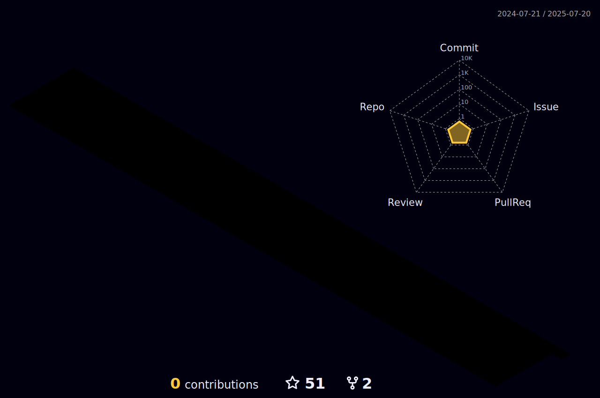

<!-- GitHub Profile README good-------->

 &nbsp; &nbsp;   &nbsp; &nbsp;  &nbsp; &nbsp; &nbsp; &nbsp; 
    

<!-- Animated Header -->

    

 

<!-- 
-->

<!--
  
-->
<!-- <h1 align="center" style="font-family: 'Times New Roman',Times, serif;">Hi, I'm Abdullah Jameel </h1>
<h3 align="center">Software Engineer | 6x Int'l Hackathon | LeetCoder 190+ | #128 Globally Ranked in MIT Informatics Winter Contest 2025 | Aspiring Developer | AI Enthusiast | Passionate Learner | Everyday explore and learn something new | @Icodeguru</h3> -->

  

## About Me:
- **@[Lead with AI Agent Hackathon 2025](https://www.linkedin.com/posts/abdullahjameel94_leadwithaiagents-leadwithaiagents-aihackathon-activity-7358786168097775616-Hq2j?utm_source=share&utm_medium=member_desktop&rcm=ACoAAFAE-g0B0fcS0OGwyJnhVIfe9NLOuS1NmyU)** Secured **3rd Place** with **Team Mavericks** in a 72-hour international hackathon by GENAI.works among 3000+ participants worldwide. [Certificate](https://github.com/user-attachments/assets/8d9f5592-4844-44d1-9caf-416396d05a90)
- **@[Stanford Code in Place 2025](https://www.linkedin.com/feed/update/urn:li:activity:7316881832187219968/)** Selected as Section Leader among ~1400 all over the world to teach python to 10-15group of international students
- **@[Contribution At Stanford Code in Place'25](https://www.linkedin.com/feed/update/urn:li:activity:7339589406451814400/)** I’ve taught 250+ Teach Now sessions as part of Stanford’s Code in Place 2025 program.
- **@[SuperStar Section Leader!](https://www.linkedin.com/posts/icode-guru_icodeguru-stanfordcodeinplace-icodeguru-activity-7342874990905561088-zexO?utm_source=share&utm_medium=member_desktop&rcm=ACoAAFAE-g0B0fcS0OGwyJnhVIfe9NLOuS1NmyU)** Selected as 1 of the top 9 Superstar Section Leaders out of 1400, after leading 250+ Teach Now sessions at Stanford Code in Place.
- **@[Harvard CS50x Puzzle Day Competition 2025](https://certificates.cs50.io/6bb8d938-6d20-4f87-a3b9-273e32d3afea.png?size=letter)** Solved all  9/9 Complex Puzzles with my  team  **@[Logic Legends](https://docs.google.com/spreadsheets/d/e/2PACX-1vSZFaNKFopIUkdy2N5qp6iA4Ij3BMtobtCRlDxLbGfrB3oupAnvHdX4tN8JEWpKkfY7DnhXORk66mB9/pubhtml)**
- **@[GitHub](https://github.com/abdullahxyz85)** Contributing DSA material daily on GitHub and my achievements.
- **@[Open Source Contribution Badge](https://www.holopin.io/userbadge/cmdc01of4299707l1rt1fvvxb)** Earned the Open Source Contribution badge after making my first contribution, excited to begin this journey in the open-source community!.
- **@[LeetCode](https://leetcode.com/u/abdullahxyz85/)** Solved [190+](https://github.com/abdullahxyz85/Daily_Leetcoding) Data Structures & Algorithms problems on LeetCode.
- **@[lablab.ai](https://lablab.ai/u/@AbdullahBhatti308)**: Competed in multiple international AI hackathons as part with a team of 6 international members.
- **@[MIT Informatics Tournament 2025](https://mitit.org/Contest/ViewScoreboard/beginner-2025)**:Ranked 128 globally in begineer round
- **@[Advent of Code]()**: Successfully completed 25 days coding challenges abd solved all the problems effectively.
- **@[Section Leader at CodeinPlace]()** I am selected as a Section Leader in CodeinPlace for teaching 
- **@[Typing Speed](https://www.linkedin.com/posts/abdullahjameel94_typingjourney-consistency-discipline-activity-7316542143076986880-KF-H?utm_source=share&utm_medium=member_desktop&rcm=ACoAAFAE-g0B0fcS0OGwyJnhVIfe9NLOuS1NmyU)**: More than 100 WPM.

  

## Skill Sets:

> Tools, languages, and other things I am working with.
<a href="https://github.com/arhamansari11/">

  

</a>
<!--<table align="center"><tr><td valign="top" width="25%">
### Machine Learning
<a href="https://github.com/arhamansari11/">

        

</a>
</td><td valign="top" width="25%">
### Frontend  
<a href="https://github.com/arhamansari11/">

  
        

</a>
 </td><td valign="top" width="25%">
### Backend
<a href="https://github.com/arhamansari11/">

        

</a>
</td>
</tr>
<tr><td valign="top" width="25%">
### Code Editors  
<a href="https://github.com/arhamansari11/">

  
        

</a>
</td><td valign="top" width="25%">
###  Languages
<a href="https://github.com/arhamansari11/">

 
     

</a>
</td><td valign="top" width="25%">
### Others 
<a href="https://github.com/arhamansari11/">

  
        

</a>
 </td> 
</tr>
</table>-->

  

 ## Connect with Me:

    
    
    
    

  

## LeetCode Stats & DSA

  
  &nbsp;&nbsp;&nbsp;
  

<!--

  

     

-->

<!--## 📢 Connect with Me

  
  
  
  

 -->

  

 ## GitHub Analytics

 <!---->

  
  

  &nbsp;&nbsp;

  

     
 

  

 
<!-- ## Activity Graph: -->

  
  <!-- GitHub Stats Section -->
 <!-- 

    

 

-->
  <!-- GitHub Stats Section -->
  <!-- -->
 <!-- ## Activity Graph:
  

 -->

## COMPLETED INTERNATIONAL HACKATHONS:

  
  &nbsp; &nbsp;
  
  &nbsp;
    
  &nbsp; &nbsp;
   
  &nbsp; &nbsp;
 
  &nbsp; &nbsp;
  
  &nbsp; &nbsp;
  
  &nbsp; &nbsp;
  
  <!-- &nbsp; &nbsp;
  
   &nbsp; &nbsp;
  
   &nbsp; &nbsp;
   -->

<!--

  
  &nbsp; &nbsp;
   
  &nbsp; &nbsp;
 
    &nbsp; &nbsp;
   
    &nbsp; &nbsp; --> 
    

  

## Achievements & Certifications

<!--

-->

  

<!--<h3 align="center">

</h3> -->
<!--<pre>
                                  ___           ___           ___       ___       ___     
                                 /\__\         /\  \         /\__\     /\__\     /\  \    
                                /:/  /        /::\  \       /:/  /    /:/  /    /::\  \   
                               /:/__/        /:/\:\  \     /:/  /    /:/  /    /:/\:\  \  
                              /::\  \ ___   /::\~\:\  \   /:/  /    /:/  /    /:/  \:\  \ 
                             /:/\:\  /\__\ /:/\:\ \:\__\ /:/__/    /:/__/    /:/__/ \:\__\
                             \/__\:\/:/  / \:\~\:\ \/__/ \:\  \    \:\  \    \:\  \ /:/  /
                                  \::/  /   \:\ \:\__\    \:\  \    \:\  \    \:\  /:/  / 
                                  /:/  /     \:\ \/__/     \:\  \    \:\  \    \:\/:/  /  
                                 /:/  /       \:\__\        \:\__\    \:\__\    \::/  /   
                                 \/__/         \/__/         \/__/     \/__/     \/__/    
</pre>-->

  
&copy; 2025 All Rights Reserved

